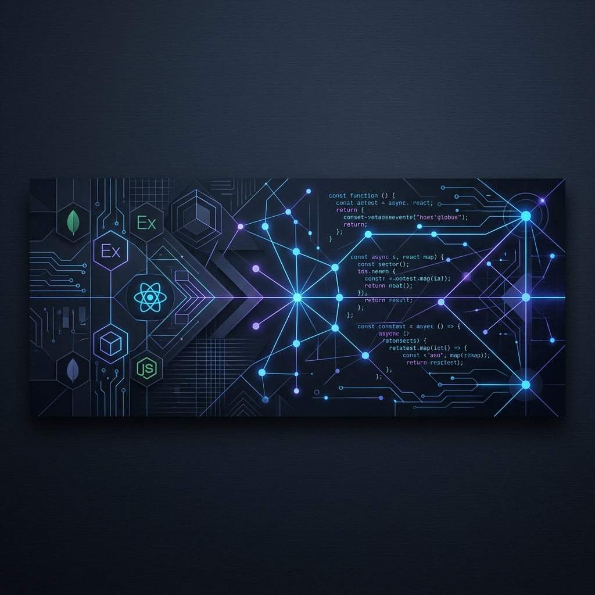

<!-- Header Banner -->

  

<!-- Title & Bio -->
<h1 align="center">Hi 👋, I'm Pawan Kumar Dubey</h1>
<h3 align="center">Full Stack Developer | MERN Stack Enthusiast | Software Engineer</h3>

  
  
  

  

---

### 🚀 About Me

I am a passionate **B.Tech Computer Science & Engineering** graduate and a **Full-Stack Developer** specializing in building modern web applications. Currently, I am deeply focused on mastering scalable system architectures and exploring the integration of Artificial Intelligence in web applications.

- 🎓 **B.Tech CSE Graduate** with a strong foundation in core computer science.
- 💻 **Full-Stack Developer** specialized in the **MERN Stack** (MongoDB, Express.js, React.js, Node.js).
- 🌱 Currently diving deep into **AI Integration** (Gemini & OpenAI APIs) and prompt engineering.
- 🧠 Strong focus on **Data Structures & Algorithms (DSA)** and competitive programming.
- ⚡ Passionate about writing clean, optimized, and maintainable code.

---

### 🛠️ Tech Stack & Skills

  <!-- Languages -->
  <b>Languages:</b> 
  
  
  
  

  <!-- Frontend -->
  <b>Frontend Development:</b> 
  
  
  

  <!-- Backend & Database -->
  <b>Backend & Database:</b> 
  
  
  
  

  <!-- Tools -->
  <b>Tools & Version Control:</b> 
  
  
  
  

---

### 🧠 Core Competencies & Areas of Interest

<table>
  <tr>
    <td width="50%">
      <b>💻 Software Engineering Core</b>
      <ul>
        <li>Data Structures & Algorithms (DSA)</li>
        <li>Object-Oriented Programming (OOPs)</li>
        <li>Database Management Systems (DBMS)</li>
        <li>RESTful API Design & Integration</li>
      </ul>
    </td>
    <td width="50%">
      <b>🌱 Current Learning & Goals</b>
      <ul>
        <li>Next.js & Server-Side Rendering (SSR)</li>
        <li>System Design (Scalability & Caching)</li>
        <li>Docker & Containerization basics</li>
        <li>AI Agent Development</li>
      </ul>
    </td>
  </tr>
</table>

---

### 🚀 Highlighted Projects

<table>
  <tr>
    <td width="50%">
      <h4>📚 AI-Powered Student Learning Platform</h4>
      
A smart education platform featuring AI tutoring, document summarization, robust user authentication, and interactive progress tracking dashboards.

      <b>Tech Stack:</b> React.js, Node.js, Express.js, MongoDB, Gemini AI
    </td>
    <td width="50%">
      <h4>💪 FitnessHub – Fitness Planner & Tracker</h4>
      
A full-featured application helping users plan workouts, track daily nutrition, and view statistics via elegant charts and interactive dashboards.

      <b>Tech Stack:</b> React.js, Node.js, Express.js, MongoDB, JWT, ChartJS
    </td>
  </tr>
  <tr>
    <td colspan="2">
      <h4>🛒 Modern E-Commerce Platform</h4>
      
A responsive online shopping site equipped with product search, category filters, a persistent Add-to-Cart drawer, secure payment integrations, and AI chatbot support.

      <b>Tech Stack:</b> React.js, Node.js, Express.js, MongoDB, Stripe
    </td>
  </tr>
</table>

---

### 🔗 Coding Profiles & Platforms

To see my problem-solving skills and coding practice, feel free to visit my profiles:

  
  
  

<i>Note: Replace the platform profile links above with your actual profile links!</i>

---

<h3 align="center">🤝 Let's Connect & Collaborate!</h3>

  
  

  <i>"Code. Learn. Build. Repeat."</i>

